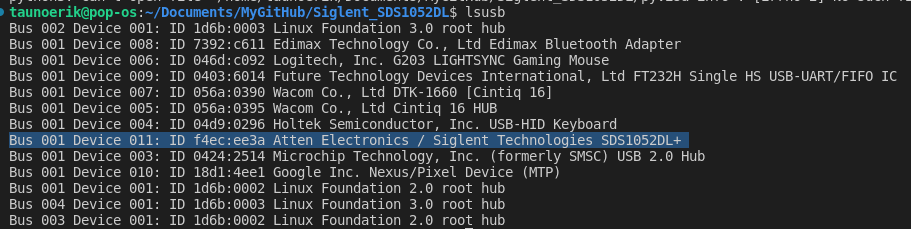

# Siglent Oscilloscope SDS1052DL +

## Documents

- [Datasheet](Datasheets/SDS1000DL+%20CML+%20Series%20Data%20Sheet-1.pdf)
- [User Manual](Datasheets/SDS1000DL+%20_%20CML+%20User%20Manual-1.pdf)
- [Programming Guide](Datasheets/SDS1000DL+%20_%20CML+%20Programming%20Guide-1.pdf)

## Terminology

**VISA** - Virtual Instrument Software Architecture

**SCPI** - Standard Commands for Programmable Instrument

Command example:

[SENSe:]VOLTage:{AC|DC}:RANGe {<range>|MINimum|MAXimum}

`VOLT:DC:RANGe MAX`

**GPIB** - General Purpose Interface Bus

## Install Python requirements

`pip3 install pyvisa pyvisa-py pyUSB pySerial zeroconf quantiphy`

## USB

Connect USB and run `lsbusb` command.



```Python
import pyvisa

rm = pyvisa.ResourceManager()

res = rm.list_resources()

print(res)
```
